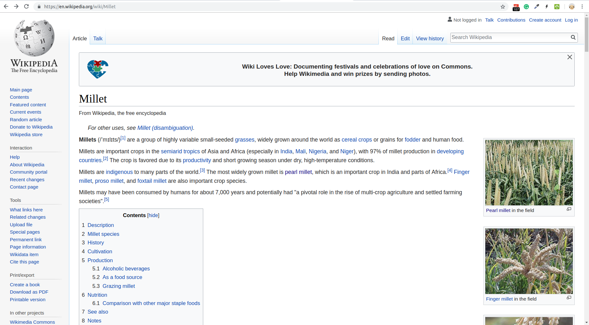

# Dictionary creation for Millet

# Initial search
Let's search for 'millet' on the web. In the search results, we get the following wikipedia page:



**MILLETS**: are a group of highly variable small-seeded grasses, widely grown around the world as cereal crops or grains for fodder and human food. The different species of millets are not necessarily closely related. *All are members of the family Poaceae (the grasses) but can belong to different tribes or even subfamilies* (From wikipedia page).

# Dictionary creation from wikipedia page
The above wiki page contains words/terms coloured in blue. If we click on a term, we will be directed to the wikipedia page for that term.  
**GOAL**: Collect all these terms in a file.    

To do so, we issue the command `ami-dictionaries` with some options. The exact command is:
```
ami-dictionary create\
 --input https://en.wikipedia.org/wiki/Millet\
 --informat wikipage\
 --dictionary millets_wikipage \
 --outformats xml,json,html \
 --directory /home/amit/Desktop/Workshop/Github/tigr2ess/millets/dictionary
```
Or we can issue the above command in one line as:
```
ami-dictionaries create --input https://en.wikipedia.org/wiki/Millet --informat wikipage --dictionary millets_wikipage --outformats xml,json,html --directory /home/amit/Desktop/Workshop/Github/tigr2ess/millets/dictionary
```  
**NOTE1** Please replace the `--directory` option with the place where you wan't to store your dictionary.
**NOTE2**: The order in which options are passed to `ami-dictionaries` is irrelevant.

**Time**: It took around 3.5 minutes for the execution of above command.  
**Size**: The combined size of the three output files (which are *millets_wikipage.html*, *millets_wikipage.json* and *millets_wikipage.xml*) is ~200KB

## Let's have a look at the three output files:
 
### millets_wikipage.xml
1. The title of the dictionary is millets_wikipage as specified by line no.2 `<dictionary title="millets_wikipage">`
2. The total number of terms is 201 with ids running from "CM.millets_wikipage.0" to "CM.millets_wikipage.200".
3. The order in which terms are listed in the file is not same as they occur in the wikipedia page. Instead, they are sorted lexicographically.
4. The first two terms in the file correspond to the booksources present in the *Notes* section of the page. Obviously this information is not useful for us. Also, there are duplicates present such as (carbohydrates, Carbohydrates).

Let's edit out the terms not relevant to millets. This is very much subjective.
The first two terms are not at all relevant, so we remove the below corresponding lines from *millets_wikipage.xml* file.
```
<entry term="92-5-103861-9" name="92-5-103861-9" url="/wiki/Special:BookSources/92-5-103861-9" id="CM.millets_wikipage.0" wikipedia="Special:BookSources/92-5-103861-9"/>
 <entry term="978-0-19-533263-6" name="978-0-19-533263-6" url="/wiki/Special:BookSources/978-0-19-533263-6" id="CM.millets_wikipage.1" wikipedia="Special:BookSources/978-0-19-533263-6"/>
```
There are too many false positive terms in *millets_wikipage.xml*, let's move to other method for dictionary creation.  

# Dictionary creation from wikipedia category page
The wikipedia category page for millets is at [https://en.wikipedia.org/wiki/Category:Millets](https://en.wikipedia.org/wiki/Category:Millets). And it looks as below:

.

We issue the following command at the terminal:
---
```
ami-dictionary create\
     --input  https://en.wikipedia.org/wiki/Category:Millets \
     --informat  wikicategory \
     --dictionary millets_category\
     --outformats  xml,json,html \
     --directory /home/amit/Desktop/Workshop/Github/tigr2ess/millets/dictionary
```
---

Or in one line as the following:
```
ami-dictionary create --input https://en.wikipedia.org/wiki/Category:Millets --informat wikicategory --dictionary millets_category --outformats  xml,json,html --directory /home/amit/Desktop/Workshop/Github/tigr2ess/millets/dictionary
```  
**NOTE** Please replace the `--directory` option in above command with the place where you wan't to store your dictionary.
**Time**: The above took ~25sec.    
**Size**: The total size of three output files is ~35KB.      

## Let's look at the three output files
### millets_category.html
We can visually inspect the terms collected, and go to the linked webpages to see more about them.

### millets_category.json
There are total 26 terms collected.

On inspection, we find that most of them are related to millets, and mostly it's scientific names. It also includes the term 'Tongba', which is a millet-based alcoholic beverage found in Nepal. 
*Whether 'Panicum antidotale' is a millet species or not could not be confirmed?*


