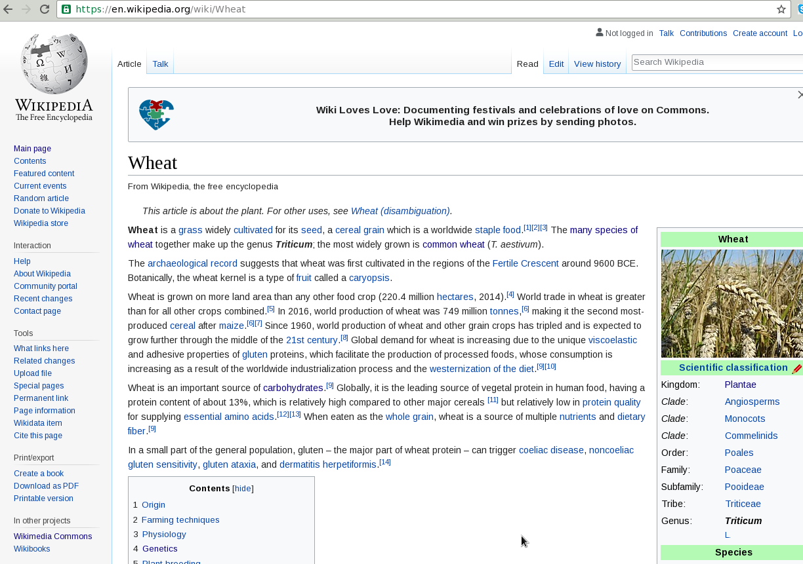
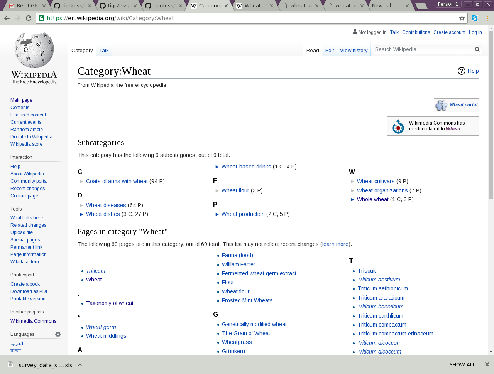

# Initial search

Let's search for 'wheat' on the web. In the search results, we get the following wikipedia page:




# Dictionary creation from wikipedia page
The above wiki page contains words/terms coloured in blue. If we click on a term, we will be directed to the wikipedia page for that term.
   
To do so, we issue the command `ami-dictionary` with some options. The command is:
```
ami-dictionary create\
 --input https://en.wikipedia.org/wiki/wheat\
 --informat wikipage\
 --dictionary wheat_wikipage \
 --outformats xml,json,html \
 --directory  /home/cbl/Desktop/AMI/Workshop/wheat/dictionary
```
Or we can issue the above command in one line as:
```
ami-dictionary create --hreftext --input https://en.wikipedia.org/wiki/Wheat --informat wikipage --dictionary wheat_wikipage --outformats xml,json,html --directory /home/cbl/Desktop/AMI/Workshop/wheat/dictionary
```


## Let's have a look at the three output files:
 
### wheat_wikipage.xml


1. The title of the dictionary is wheat_wikipage as specified by line no.2 `<dictionary title="wheat_wikipage">`
2. The total number of terms is 416 with ids running from "CM.wheat_wikipage.0" to "CM.wheat_wikipage.416".
3. The order in which terms are listed in the file is not same as they occur in the wikipedia page. Instead, they are sorted lexicographically.

Let's edit out the terms not relevant to wheat. This is very much subjective.
The first two terms are not at all relevant, so we remove the below corresponding lines from *wheat_wikipage.xml* file.
```
<entry term="21st century" name="21st century" url="/wiki/21st_century" id="CM.wheat_wikipage.0" wikipedia="21st_century"/>
<entry term="Abu Hureyra" name="Abu Hureyra" url="/wiki/Abu_Hureyra" id="CM.wheat_wikipage.1" wikipedia="Abu_Hureyra"/>
```

### (edited version of .json file )


**In json file we can eliminate extra terms using any notepad(here i use `gedit`),i showed here that how can we find terms which are only belongs to wheat.I find a term`weetabix` which belongs to wheat thats why i do not remove it from json file .**

**Another example is `wheat(film)` (id="CM.Wheat_category.54") is not belong to wheat ,cereal(grain) so we have to rmove this one.** 


 **let's move to other method for dictionary creation.**  

# Dictionary creation from wikipedia category page:

The wikipedia category page for wheat is at [https://en.wikipedia.org/wiki/Category:Wheat](https://en.wikipedia.org/wiki/Category:Wheat). And it looks as below:



We issue the following command at the terminal:
```
ami-dictionary create\
     --input  https://en.wikipedia.org/wiki/Category:Wheat \
     --informat  wikipage \`(we are giving wikipage as informat because if we use wikicategory as informat it gives an error and create only html output)`
     --dictionary wheat_category\
     --outformats  xml,json,html \
     --directory  /home/cbl/Desktop/AMI/Workshop/wheat/dictionary
```

Or in one line as the following:
```
ami-dictionary create --hreftext --input https://en.wikipedia.org/wiki/Category:Wheat --informat wikipage --dictionary wheat_category --outformats  xml,json,html --directory  /home/cbl/Desktop/AMI/Workshop/wheat/dictionary
```
   

The output on the terminal for the above command is huge. The end portion of it looks as below:
```
................
..........................
termCol       null
terms         null
0    [main] DEBUG org.contentmine.ami.lookups.WikipediaDictionary  - failed to find header
>CM.wheat_category.0>CM.wheat_category.1>CM.wheat_category.2>CM.wheat_category.3>CM.wheat_category.4>CM.wheat_category.5>CM.wheat_category.6>CM.wheat_category.7>CM.wheat_category.8>CM.wheat_category.9>CM.wheat_category.10>CM.wheat_category.11>CM.wheat_category.12>CM.wheat_category.13>CM.wheat_category.14>CM.wheat_category.15>CM.wheat_category.16>CM.wheat_category.17>CM.wheat_category.1850   [main] DEBUG org.contentmine.ami.tools.AMIDictionaryTool  - skipped non-wikipedia link: [nu.xom.Attribute: url="//www.mediawiki.org/wiki/Special:My..."]
>CM.wheat_category.19>CM.wheat_category.20>CM.wheat_category.21>CM.wheat_category.22>CM.wheat_category.23>CM.wheat_category.24>CM.wheat_category.25>CM.wheat_category.26>CM.wheat_category.27>CM.wheat_category.28>CM.wheat_category.29>CM.wheat_category.30>CM.wheat_category.31>CM.wheat_category.32>CM.wheat_category.33>CM.wheat_category.34>CM.wheat_category.35>CM.wheat_category.36>CM.wheat_category.37>CM.wheat_category.38>CM.wheat_category.39>CM.wheat_category.40>CM.wheat_category.41>CM.wheat_category.42>CM.wheat_category.43>CM.wheat_category.44>CM.wheat_category.45>CM.wheat_category.46>CM.wheat_category.47>CM.wheat_category.48>CM.wheat_category.49>CM.wheat_category.50>CM.wheat_category.51>CM.wheat_category.5251
52   [main] DEBUG org.contentmine.ami.tools.AMIDictionaryTool  - writing dictionary to /home/cbl/ContentMine/dictionary/dictionaries/wheat_category.xml
54   [main] DEBUG org.contentmine.ami.tools.AMIDictionaryTool  - writing to /home/cbl/ContentMine/dictionary/dictionaries/wheat_category.json
54   [main] DEBUG org.contentmine.ami.tools.AMIDictionaryTool  - writing dictionary to /home/cbl/ContentMine/dictionary/dictionaries/wheat_category.json
102  [main] DEBUG org.contentmine.ami.tools.AMIDictionaryTool  - writing to /home/cbl/ContentMine/dictionary/dictionaries/wheat_category.html
+++++++++++++++++++++++++++++++++++++++++
``` 

## Let's look at the three output files


### wheat_category.html
We can visually inspect the terms collected, and go to the linked webpages to see more about them.

### wheat_category.json
There are total 76 terms collected.

*On inspection, we find that most of them are related to wheat, and mostly it's scientific names. It also includes the term 'weetabix',Weetabix is a whole grain wheat breakfast cereal produced by Weetabix Limited in the United Kingdom.* 

*`Wheatena term` in wheat.jason is an American high-fiber, toasted-wheat cereal that originated on Mulberry Street in New York *

**Wheat**: Wheat is a grass widely cultivated for its seed, a cereal grain which is a worldwide staple food. The many species of wheat together make up the genus Triticum; the most widely grown is common wheat (T. aestivum).* (From wikipedia page).
