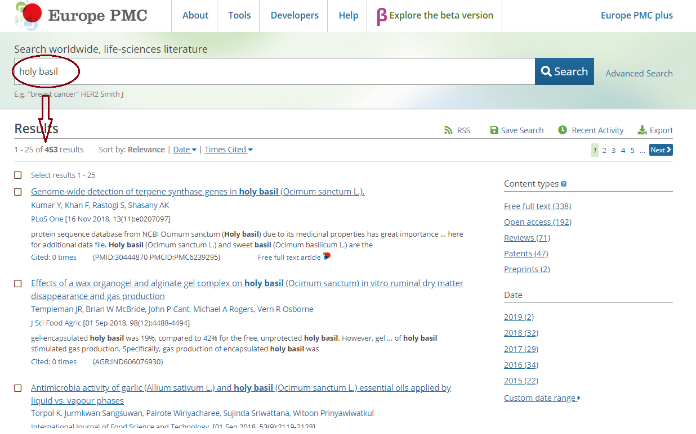
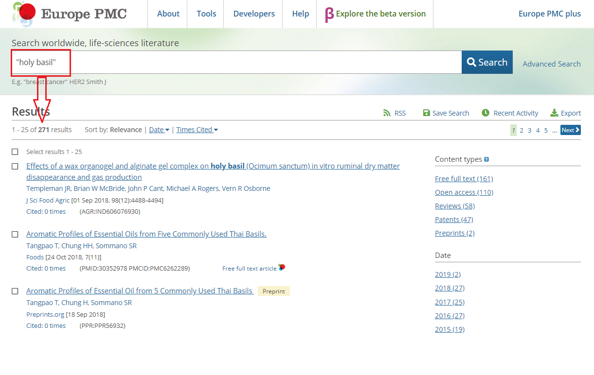
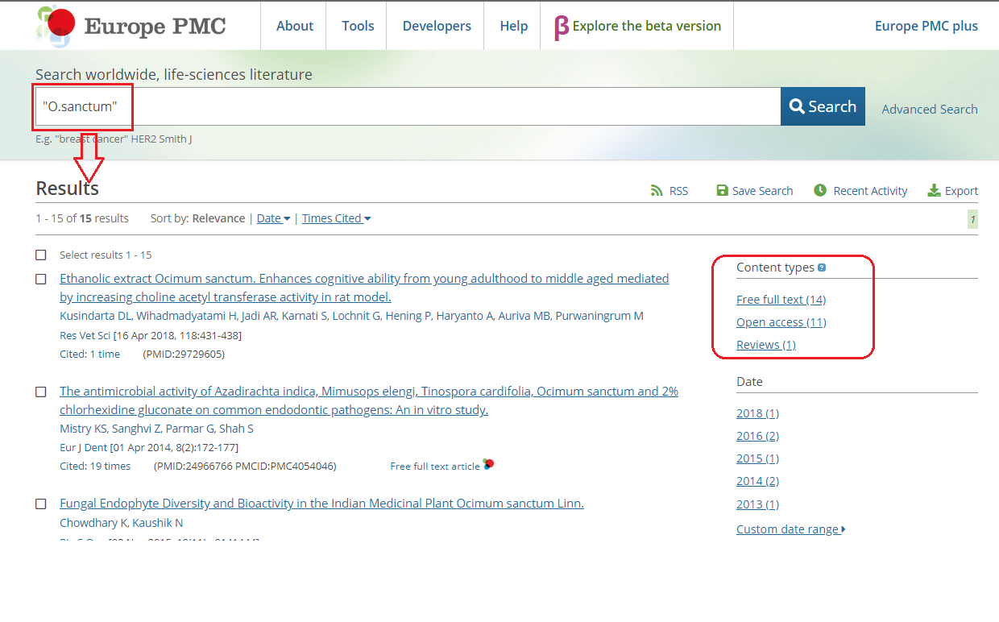
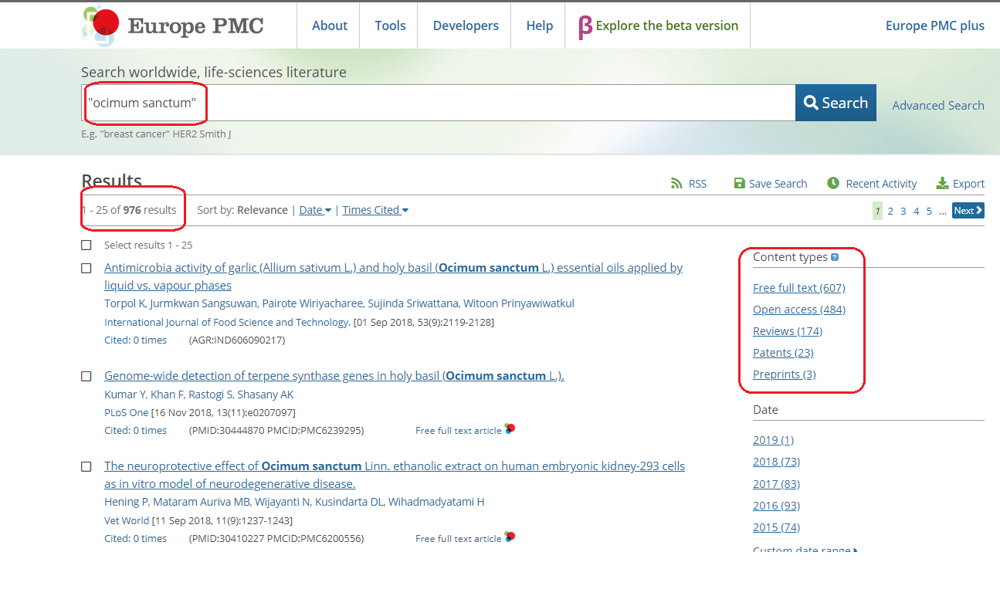
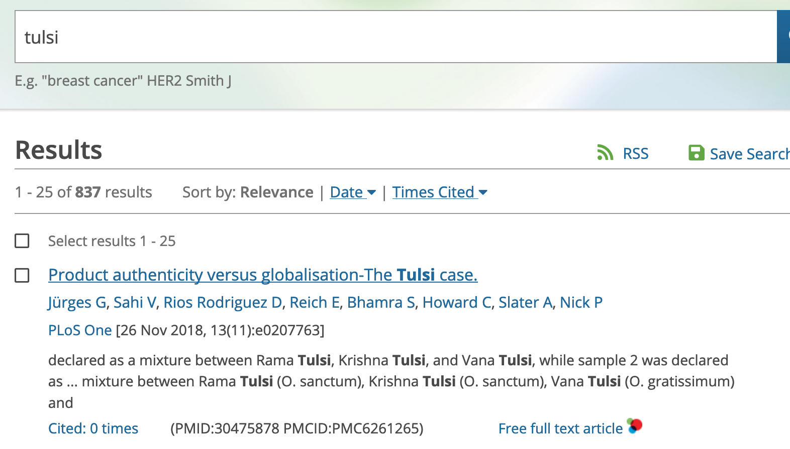
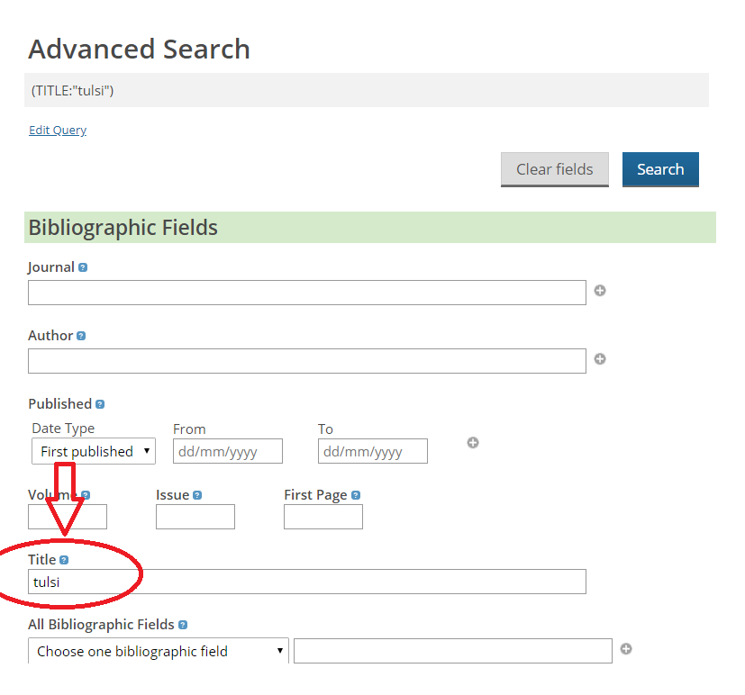
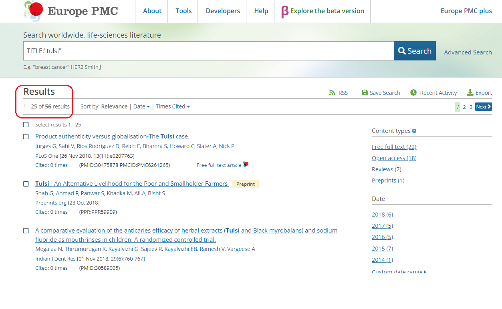
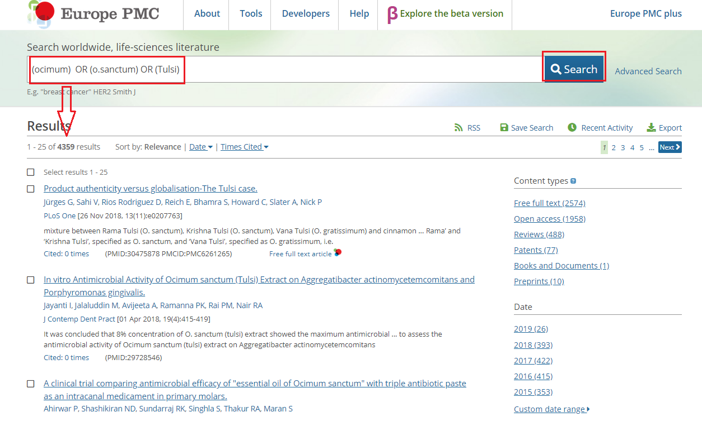
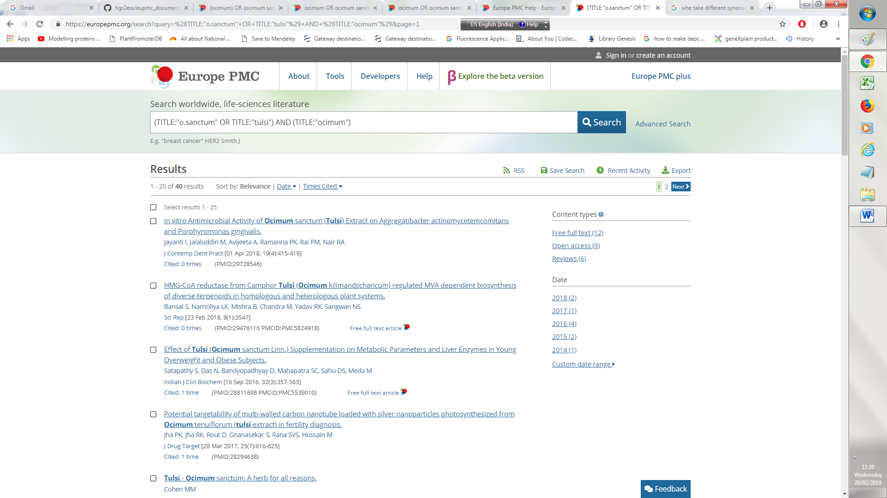

# What is Europe PMC?

  *Europe PMC is a repository, providing access to worldwide life sciences articles, books, patents and clinical guidelines. Europe PMC    provides links to `relevant records` in databases such as Uniprot, European Nucleotide Archive (ENA), Protein Data Bank Europe (PDBE)    and BioStudies.*

**By default, the Europe PMC RESTful(one of the `API`of epmc searches)  search results are sorted by relevance, with the most relevant result being presented first in the list.**

# How Can we  search Europe PMC?

  *The main Europe PMC site provides two search functions: a free text search, direct from the `main search box`, or `an advanced    search`, from the advanced search page which provides you with a number of different parameter(Operators) options.*

## EPMC query window

* Open [Query window](http://europepmc.org)

**search for "Holy basil".** 
---
*Action:* Enter `Holy basil` into the window
---
---

   *We always give the query in either single-quotes(') or in double-quotes(") because in quotes it takes as a compelet query otherwise     `EPMC` search it for words only* 
   
   if we type `holy basil`, then it  search for holy and basil for two different words only `not as a query`.
   
   

# Step 1.
   
    Type  `holy basil` into EPMC Search box and get following results.

  
  
 
  
  # Step 2.
  
    Type  ` "Holy basil" ` we get following results:
    
    
    
    
  
  
  
  
  
  *`So from here we get an idea that how we should put our queries in proper way into EPMC searche box and get Relevant results.`*
  
  
  # Further More  Queries For Better Understanding.
 
 
  
  **Type ` "O.sanctum" ` as a query we get :15 results as showed below**
 
  
  
  
  
  
  
  
 
  
  **Type ` "Ocimum sanctum" ` as a query we get :976 results below**
  
  
  
  
  
  
  
  
  
  
  **Type  "Ocimum" as a query it searches for only ocimum in articles and gives the:3650 results**
  
  
  
  
  
  
  
  
  
  
  
  
  
  
  
  
  **Using Advanced search we can remove false-positive i.e we can eliminate the False information from search which we Don't want to be in our search.**
  
  
  
  
  *Example to remove false-positive,type `"tulsi"` in your search box of eupmc and get:835 results.*
  
  
  
  
  
  
  **Now Open your advance search box and type tulsi in `title` in Bibliographic Fields:as shown below**
  
  
  
  
  
  
  
 
  **we can see that using `TITLE:"tulsi"` Advanced search we get: 56 hits of tulsi**
  
  
  
  
  
  
  
  
  
  
  
  **Here we get a clear picture of `Advanced search ` that how it eliminate the false-positive ,when we are using "tulsi" we get so many hits because it search tulsi as a  word which mean it can be name of any human-being(tulsi) but after using `TITLE:"tulsi" ` it give only 56 hits ,that means we get ourresults only regarding scientific query.**
  
  
  
  
  
  **To Search how many Authors are from NIPGR and Cmbridge type `(AUTH_CON:"cambridge" OR AUTH_CON:"nipgr")`**
  
  
  
  
  
  
  **After clicking on   `Open Access Button` on right-hand corner of  Content-Types to see all Downloadable papers from EPMC.**
  
  
  
  
  **Search using Different Synonyms, Type `(ocimum) OR (o.sanctum) OR (Tulsi)` in the `search box` we get the following results.**
  
  
  
  
  
  
  
  
  **Type your `Synonym ` Query into Advance search box  as shown below and  we get different results.**
  
  
  
  
  
  
  
  # NOTE: Use Operators (AND , OR , NOT) While using Synonyms.
  
  
  
 *Suppose we want something `only in Body`  NOT in the Title then type your query in Advance search as following in Bibliographic Fields.*
  
  
  
  
  
  
  
  
  ## Try following Excercises of wheat,you get to know how exactly EPMC searches give results.
  
  # Queries You can try
  
1. Wheat papers since 2015:

(PUB_YEAR:"PUB_YEAR:[2015 TO 2019]") AND (TITLE:"Wheat")--> 47974 results
(Title=wheat-->All Bibliographic Field-->year-publication=PUB_YEAR:[2015 TO 2019])

2. Authors from nipgr OR cambridge :

(AUTH_CON:"cambridge" OR AUTH_CON:"nipgr")
(Article Sections) -->(Author contributions)

3. Find wheat but Not in the Title :

(KW:"wheat" NOT TITLE:"wheat") AND (IN_EPMC:y) AND (OPEN_ACCESS:y)--> 357 results

4. wheat in Body only:

(KW:"wheat" NOT TITLE:"wheat" OR ABSTRACT:"wheat") 4923 results 
  
