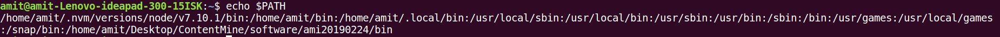

Please follow the below steps for setting path

**Step1**: Open your `.bashrc` file. It is usually inside the user home folder (/home/user_name). Note that this is a hidden file, you will have to tick `show hidden files` options. On some systems, if above file is not present, open `bash_profile`.

**Step2**: Add the following line at the end of `.bashrc`. Save `.bashrc` file and close it.

`export PATH="$PATH:$HOME/Desktop/ContentMine/software/ami20190224/bin"`

**Step3**: Open terminal. And run the command `echo $PATH`. It should look as following - having string `/Desktop/ContentMine/software/ami20190224/bin` at the end.

