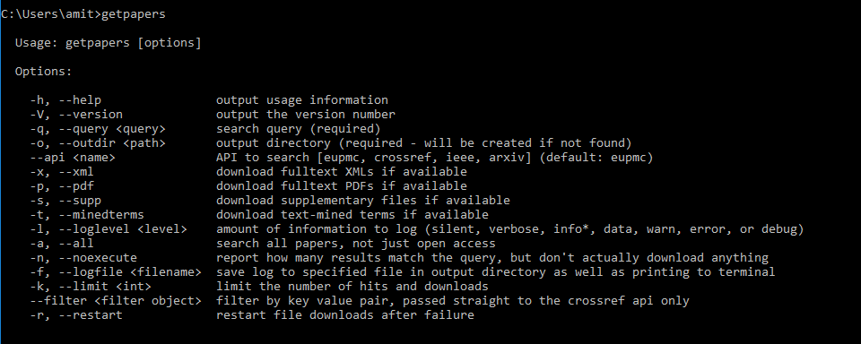
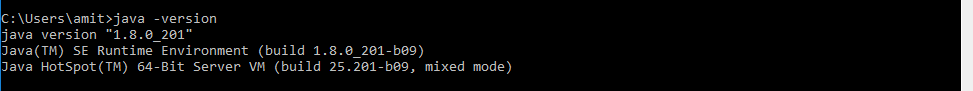

## INSTALLATION of `getpapers`

Please follow the below steps for installing `getpapers`.

### Step1: installing `nvm-windows`

Go to the [downloads page](https://github.com/coreybutler/nvm-windows/releases) and download latest version of `nvm-setup.zip`. 

Unzip the downloaded file and run the included installer.

### Step2: installing `node`

Open your command prompt, and run the following commands one after the other.

```
nvm install 7
nvm use 7.10.1
```


### Step3: installing a `node` tool:

Run the following command at command prompt:
```bash
npm install --global getpapers
```

Now run the command `getpapers` at the command prompt, and you should see something as below:



## INSTALLATION OF `ami`

Please follow the below steps for installing `ami`.

#### Step1: JAVA

Please check that you have java8(same as java version 1.8) installed on your system by running the command `java -version` at the command prompt. It should look as following:



It is important that above you get java version 1.8 , and not java version 1.7 or any earlier version. 
If you don't have java version 1.8, please dowload it from the this link https://www.java.com/en/download/.

Also, please follow the following instruction for installing latest JDK
- Download and Install the latest JDK for your OS from <a href=https://www.oracle.com/technetwork/java/javase/downloads/jdk8-downloads-2133151.html>here</a>	
- Check your JAVA Installation <a href=https://www.java.com/en/download/help/version_manual.xml>here</a>	
- Open a Terminal and type <code>java -version</code>	
- Make sure you have the latest version (At the time of writing: We have 1.8_201)

#### Step2: Set path
For Windows10, click here https://github.com/petermr/tigr2ess/blob/master/installation/windows/set_path/set_path.md
Please follow this step after you have got the `ami` software in the pendrive. This step will be updated

#### Step3:
Copy the ContentMine folder present in the pendrive onto the Desktop of your step. 

#### Step4:
Open the command prompt and execute `ami-pdf`. Your screen should look as below:


## Issues

Steps for setting environment PATH variable may slightly differ from one platform to another. Always try to locate systems setting followed by advanced system settings. Always try to keep the value of environment variable - PATH as short as possible. Else there may be error running the tools/plugins. I extracted jars and placed all contents - bin/, repo/, dependencies into C:/ directory and then exported the PATH for C:/bin 
