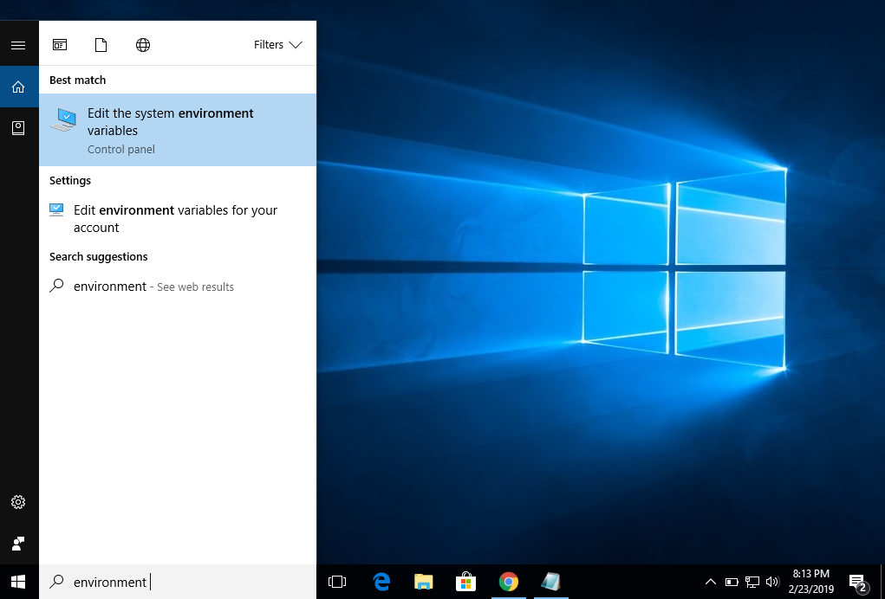
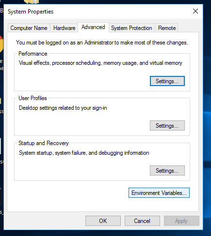
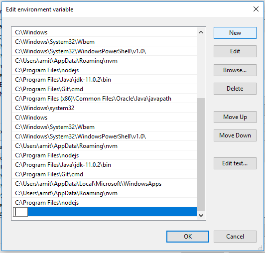
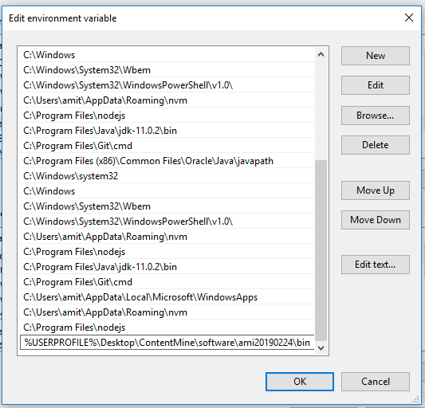
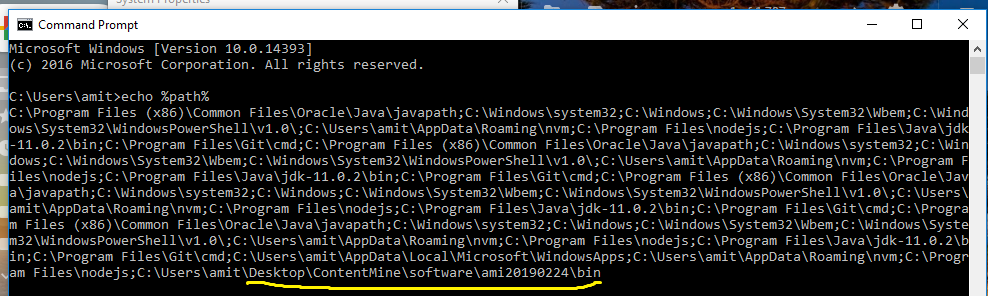

Please follow the below steps for setting `path` variable.
**IMPORTANT** The screenshots below are taken for **Windows10**. It would look similar on other Windows versions.

**STEP1:** Go to the Search box and type `environment`. You should see the below screen. 

**STEP2:** Click on the `Edit the system environment variables` in above picture. On doing so, you get a window as below.

**STEP3:** Click on the `Environment Variables` button present at the bottom of the window in above picture. A new window will open. Click on the button `New` present at the top right corner of the window. It looks as below:

**STEP4:** Now enter `%USERPROFILE%\Desktop\ContentMine\software\ami20190224\bin` in the above highlighted cell. It appears as below:

**STEP5:** Click the `OK` button present in the above dialog box. Close all the opened windows. 
 
**STEP6:** Open the command prompt. And run the command `echo %path%`. You should see something as below which is highlighted in yellow.

