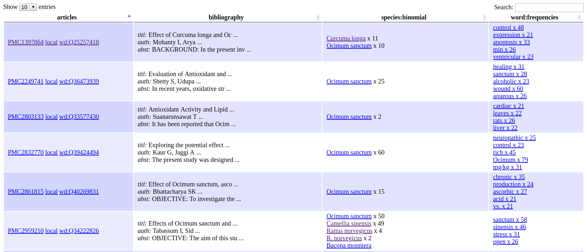
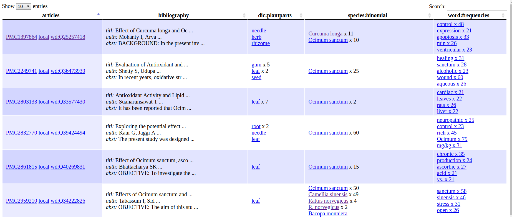
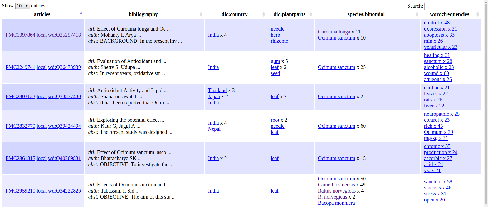
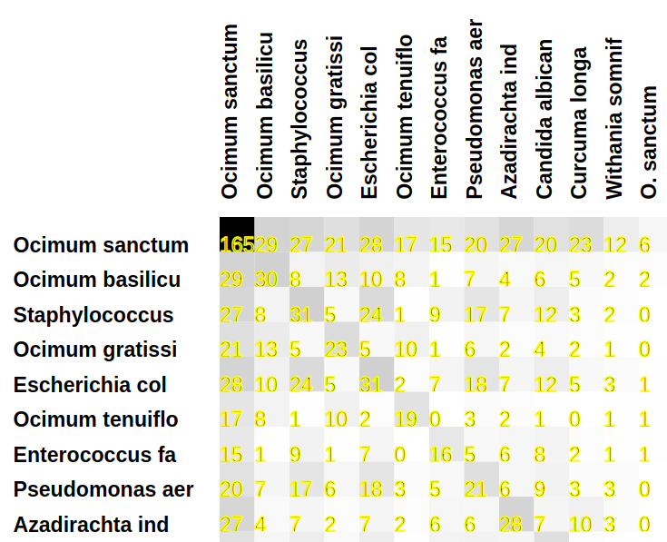
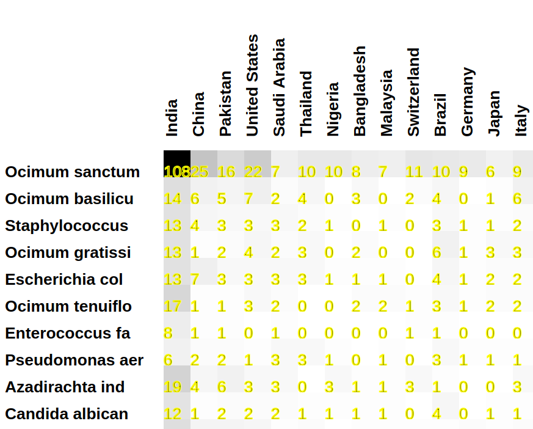

# SEARCH with AMISearch and dictionaries

## Purpose of Tutorial

To search and analyse a local corpus of scientific publications using `AMISearch` and local dictionaries.

## Resources and software required

* `osanctum200` directory (200 papers related to *Ocimum sanctum* ).
* `ami-search-new` software including builtin dictionaries.
* local ContentMine format dictionaries created by previous `ami-dictionary` or pre-loaded.

## Instructions
### Ocimum corpus
You should start with a corpus of 200 XML articles for *Ocimum sanctum*. You should have created this under the [getpapers](../getpapers/) tutorial but if not there is a corpus here called `ocimum200`. We have also created a copy of this [ocimum](./ocimum) which you can recopy to `ocimum200` if anything goes wrong.


Work in the current `tigr2ess` directory. This will *modify* your `osanctum200` files.
```
cd <myworkspace>/tigr2ess
```
check this contains `osanctum200`.

### backup (only if required)
```
cd <myworkspace>/tigr2ess
cp -R ocimum/ ocimum200/
```

## workflow steps

* Start with the `country` dictionary which is bundled in the software. This is a simple lookup against Wikipedia's list of countries.
* Then use `species` which is a syntax-driven search.
* Then use a local dictionary (`ocimum`) for personal search.


### COMMAND1 Country

* The "country" dictionary is bundled in the software and is a simple lookup against Wikipedia's list of countries. 

- Issue the following command:
---
```
ami-search-new -p osanctum200/ --dictionary country
```
---
---

### explanation of command
* `osanctum200` is the `CProject` containing the 200 papers from `getpapers`. It contains 200 `CTree`s such as 
```
├── PMC1397864
│   ├── eupmc_result.json
│   ├── fulltext.xml
├── PMC2249741
│   ├── eupmc_result.json
│   ├── fulltext.xml
```
The search needs to be done on HTML files so the first time `ami-search` is called it will silently transform XML to HTML (`scholarly.html`). Therefore the first `ami-search` will take more time.
```
.
├── PMC1397864
│   ├── eupmc_result.json
│   ├── fulltext.xml
│   ├── scholarly.html
    .
├── PMC2249741
│   ├── eupmc_result.json
│   ├── fulltext.xml
│   ├── scholarly.html
    .
├── PMC2803133
│   ├── eupmc_result.json
│   ├── fulltext.xml
│   ├── scholarly.html
    .
	.
```

The dictionary is a `builtin` dictionary and included in `ami`. 

### expected output
*Expected Time*: 2min  
```
--------------------------
cProject: osanctum200

running: word; word([frequencies])[{xpath:@count>20}, {w.stopwords:pmcstop.txt stopwords.txt}]............................................................
running: species; species([binomial])[]SP: ./ami20190219b/osanctum200............................................................
create data tables
rrrrrrrrrrrrrrrrrrrrrrrrrrrrrrrrrrrrrrrrrrrrrrrrrrrrrrrrrrrrrrrrrrrrrrrrrrrrrrrr

```
The `.` etc. are indicators that the search is progressing. Large files (> 50 pp) are slow and searches (especially `species`)  are truncated. 

### fullDataTables.html
This is the most important output (ignore most other files at this stage). It's a rectangular table whose *columns* are the searches and the *rows* are the papers.

- Open `full.dataTables.html` in a web-browser. It looks following: 

  

### explanation

AMI has run several searches on the corpus (say 200 articles). Each article is a *row* and each seach is a *column*. Columns are of several types:
* ***Column 1*** . This gives the link to the original paper on the web (labelled "PMCdddddd"), a transformed copy ("local") which is created in your corpus and (optionally) a link to the Wikidata bibliograph (see later).
* ***Column 2***. Bibliographic data (title, authors, abstract). Mouse over this to see the full data.
* ***Dictionary searches*** (**dic:subject**). These mirror the dictionaries you used for the search. Hyperlinks are to Wikipedia articles (if they exist - online lookup is expensivde so we omit it by default.)
* ***Species and genes***. The pseuo-dictionary command does not actully lookup species or use a dicry for searching but extracts words/phrases on their lexical basis. Do they fit the regex for species , and are they italic? Genes are similar. Again we give the wikipedia link but some of these will be false positives.
* ***Word clouds*** Right-hand column. A simple word frequency table, linked ot possible Wikipedia pages. Surprisingly noise-free and very useful.

Other files will be explained later


### COMMAND2
- Issue the following command (or copy-paste):    
`ami-search-new -p ./ami20190219b/osanctum200/ --dictionary plantparts`    
*Expected Time*: 1.5min  
*Output*:  
```

cProject: osanctum200

running: word; word([frequencies])[{xpath:@count>20}, {w.stopwords:pmcstop.txt stopwords.txt}]............................................................
running: search; search([plantparts])[]............................................................
create data tables
rrrrrrrrrrrrrrrrrrrrrrrrrrrrrrrrrrrrrrrrrrrrrrrrrrrrrrrrrrrrrrrrrrrrrrrrrrrrrrrr

```
- Open `full.dataTables.html` in a web-browser. It looks following:  
 


### explanation of files
Here's the result of searching with `country`, `drugs`, `plantparts` - a single `CTree` is shown: Note the `results` directory
 created by the searches.
 
```
PMC6296643/
├── eupmc_result.json
├── fulltext.xml
├── results
│   ├── search
│   │   ├── country
│   │   │   └── results.xml
│   │   ├── drugs
│   │   │   └── empty.xml
│   │   └── plantparts
│   │       └── results.xml
│   └── word
│       └── frequencies
│           ├── results.html
│           └── results.xml
├── scholarly.html
├── search.country.count.xml
├── search.country.snippets.xml
├── search.drugs.count.xml
├── search.drugs.snippets.xml
├── search.plantparts.count.xml
├── search.plantparts.snippets.xml
├── word.frequencies.count.xml
└── word.frequencies.snippets.xml
```
The tree-like structure `search:country` reflects the dictionaries used. Not that `word` has its own tree structure. Other tree-tops are `species`, `gene` , `regex` . 

### scholarly html 
This is an HTML file created automatically from the XML. It is the prime target for searching, etc. and the target "local" link.

### annotations
Here we detect *entities in context* (words or phrases embedded in the text). WE use the W3C annotation Recommendation, which identifies the entity ("exact") , the phrase preceding it ("pre") and thefollowing phrase ("post"). This makes it easy to re-search. 
The search results are put in `results.xml`, typically `results/search/country/results.xml` contains:
```
<?xml version="1.0" encoding="UTF-8"?>
<results title="country">
 <result pre="&amp;amp; Biotechnology 1687-157X 2090-5920 Academy of Scientific Research and Technology," exact="Egypt" post="pmcid: 6296643 S1687-157X(16)30074-9 doi: 10.1016/j.jgeb.2016.12.004 : VI : Plant"/>
 <result pre="of Africa however, few species of Basil are native to" exact="India" post="[6]. In India, so far about nine species of"/>
 <result pre="30″ E – 87° 48′ 37″ E longitude), West Bengal," exact="India" post="and were maintained in the AASM garden of Raiganj"/>
 <result pre="of all the species was made by Botanical Survey of" exact="India" post="(BSI), Kolkata and voucher specimens were deposited in the"/>
 <result pre="time from this region as well as from West Bengal," exact="India" post="and believe that the present work will shed a"/>
 <result pre="Basu B.D. Indian Medicinal Plants 1984 Lalit Mohn Pub Allahabad," exact="India" post="40 Sastry K.P. Kumar R.R. Kumar A.N. Sneha G."/>
 <result pre="Raiganj University for providing lab facilities and Botanical Survey of" exact="India" post="(BSI), Kolkata for identification of nine Ocimum genotypes. Indian"/>
 <result pre="Breeding Section, Department of Botany, University of Kalyani, West Bengal," exact="India" post="and Dr. Soumen Saha, Assistant Professor, Department of Sericulture,"/>
</results>
```
The content of `results.xml` depends on the type of search.

### empty.xml
This is an empty file to show there were no results.

### search.* files
These are further analyses of the `results.xml` files, e.g. aggregating the counts. These are still being developed (some are empty by mistake).


### COMMAND3
- Issue the following command (or copy-paste):  
`ami-search-new -p ./ami20190219b/osanctum200/ --dictionary country`  
*Expected Time*: 1.5min  
*Output*:  
```

cProject: osanctum200

running: word; word([frequencies])[{xpath:@count>20}, {w.stopwords:pmcstop.txt stopwords.txt}]............................................................
running: search; search([country])[]............................................................
create data tables
rrrrrrrrrrrrrrrrrrrrrrrrrrrrrrrrrrrrrrrrrrrrrrrrrrrrrrrrrrrrrrrrrrrrrrrrrrrrrrrr

```
- Open `full.dataTables.html` in a web-browser. It looks following: 
 


### project level files:
The immediate children of a `cproject` are:
* the trees (PMCddddd)
* metadata files
* summary files generated by AMI

Here are the `tigr2ess` children:
```
__cooccurrence//
commonest.dataTables.html
count.dataTables.html
entries.dataTables.html
eupmc_fulltext_html_urls.txt
eupmc_results.json
full.dataTables.html
...
and the bottom
...
```
rawTree.txt
search.drugs.count.xml
search.drugs.documents.xml
search.drugs.snippets.xml
search.plantparts.count.xml
search.plantparts.documents.xml
search.plantparts.snippets.xml
species.binomial.count.xml
species.binomial.documents.xml
species.binomial.snippets.xml
word.frequencies.count.xml
word.frequencies.documents.xml
word.frequencies.snippets.xml
```
* ***__cooccurrence*** is the toplevel of the analysis of cooccurrence of entities in documents.
* `eupmc_fulltext_html_urls.txt` and `eupmc_results.json` were created as metadata by `getpapers`.
* `commonest.dataTables.html count.dataTables.html entries.dataTables.html full.dataTables.html` are 4 different 
views on the the results.
* The trailing files are aggregated from the `CTree` results and represent the statistics over the whole of the corpus. (Note that due to a bug only the  `snippets.xml` are useful). The snippets are a useful indication for humans of what context the entities occur in.


### COOCCURENCE INTERPRETATION

- Go to `__cooccurrence` directory, then to `binomial-binomial` directory. Inside it, open `cooccur.svg` in a web-browser.



### interpretation.
The cooccurrence here is *within the same document*. That means that the link between two entities may be weak. It is possible to re-analyze the snippets to find co-occurrence in the same sentence but not here.


### COMMAND4

- Issue the following command:  
`ami-search-new -p ./ami20190219b/osanctum200/ --dictionary species country`  
*Expected Time*: 2.5min  
*Output*:  
```

cProject: osanctum200

running: word; word([frequencies])[{xpath:@count>20}, {w.stopwords:pmcstop.txt stopwords.txt}]............................................................
running: species; species([binomial])[]SP: ./ami20190219b/osanctum200............................................................
running: search; search([country])[]............................................................
create data tables
rrrrrrrrrrrrrrrrrrrrrrrrrrrrrrrrrrrrrrrrrrrrrrrrrrrrrrrrrrrrrrrrrrrrrrrrrrrrrrrr
```

- Go to `__cooccurrence` directory, then to `binomial-binomial` directory. Inside it, open `cooccur.svg` in a web-browser.  



*Interpretation*: `Ocimum Sanctum` occurs maximum with country `India`, followed by `China`. 


