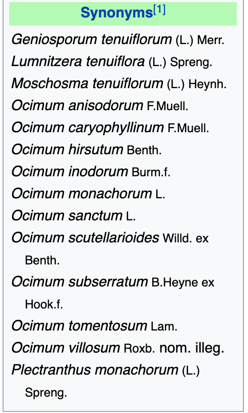
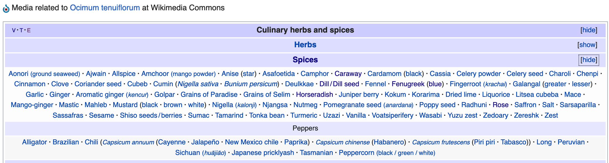
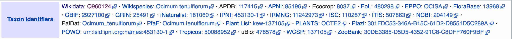
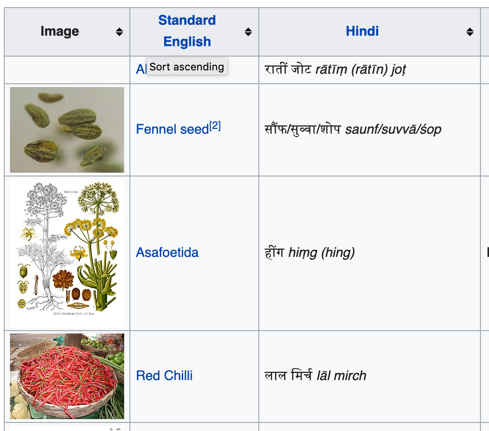
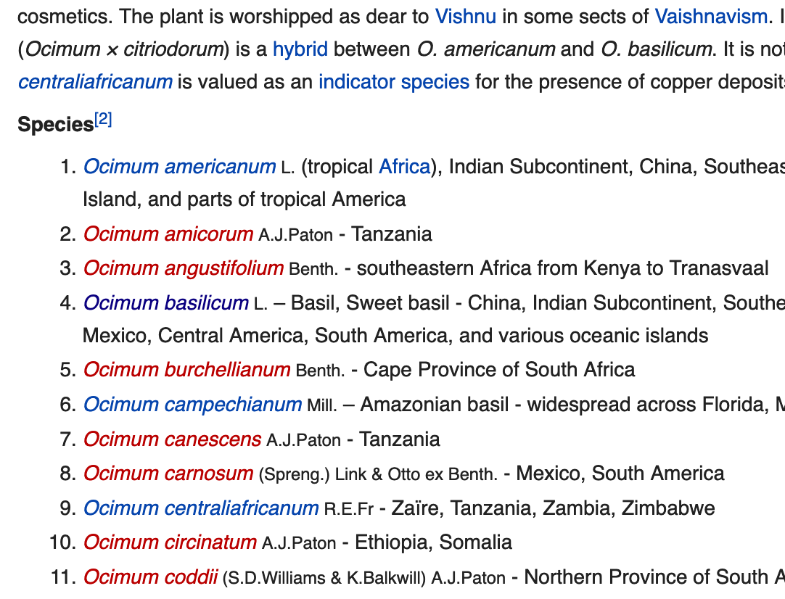

# Wikipedia and Wikidata

These are the key resources for adding semantics to the documents we extract. Most of you will know Wikipedia, but Wikidata is a new
extension. It provides structured precise knowledge for machines to process and it's very well supported in biomedical where many of the main 
databases (e.g. MESH) have been integrated. The plant taxonomy support is good and many of the identifier systems (USDA, GBIF, ITIS ... at least 25) have been 
incorporated.

We will use *Ocimum sanctum* as our example.

## Wikipedia for *O. Sanctum* (plant)

If we look for *Ocimum sanctum* in Wikipedia we are redirected to
https://en.wikipedia.org/wiki/Ocimum_tenuiflorum .
This is because *Ocimum tenuiflorum* is a **synonym** and preferred in Wikipedia. 

### header
The first sentence of the entry/page is very useful, especially when creating dictionaries.

This shows disambiguation, and the first line shows synonyms.
### taxonomy and synonyms (right)

<table>
  <td></td> 
  
  <td> </td>
  
  <td></td>
  
  </tr>
</table>

### classifcations (bottom)

list:

identifiers:

categories:

## red links
In many cases, especially for species, there are links to non-existent pages. 
## Wikipedia for Menthol (phytochemical)

https://en.wikipedia.org/wiki/Menthol

Note the huge *infobox* on the right. This contains:
<table>
<tr>
  <td></td>
  <td></td>
  <td></td>
  <td></td>
  </tr>
</table>

## Special Wikpedia Pages

Wikipedia has a number of pages which are not about single topics, but lists of pages. These are extremely valuable for making dictionaries. Here are some of the types you can use

### Wikipedia table-list page:

https://en.wikipedia.org/wiki/List_of_Indian_spices

This contains a list, arranged as a table:

<table><tr><td width="50%"></td><td width="50%"></td></tr></table>

These types of table-list will be very useful later. They can occur as single pages and also list-bars at the bottom of pages.

### Wikipedia category page

https://en.wikipedia.org/wiki/Category:Millets

Categories are very valuable as they are part of the semantic system and can be used in Wikidata. Categories occur as single pages (as above) and also in category bars at the bottom of pages.

### simple lists in pages
These are less structured but are common for family/genus/species. They often give good extraction, but can also be messy. https://en.wikipedia.org/wiki/Ocimum gives a list of species and we can extract these if required.

This is autogenerated from a taxonomym database. The **red links** are species in the database but not in Wikipedia. (Probably many of them should be.) It's straightforward to extract all the links with the standard `wikipage` option.

All this leads to [Wikidata](wikidata.md) ...

