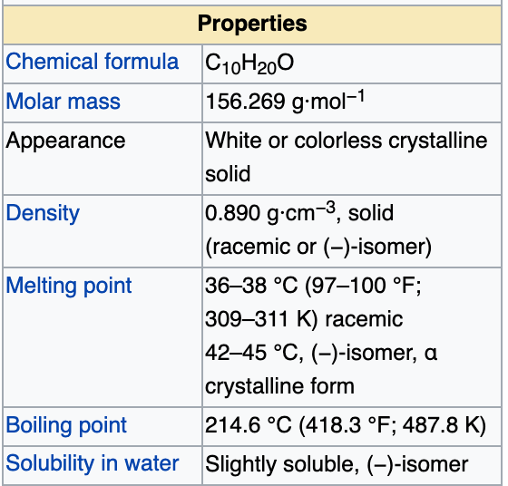

# Wikipedia and Wikimedia

These are the key resources for adding semantics to the documents we extract. Most of you will know Wikipedia, but Wikidata is a new
extension. It provides structured precise knowledge for machines to process and it's very well supported in biomedical where many of the main 
databases (e.g. MESH) have been integrated. The plant taxonomy support is good and many of the identifier systems (USDA, GBIF, ITIS ... at least 25) have been 
incorporated.

We will use *Ocimum sanctum* as our example.

## Wikipedia for *O. Sanctum* (plant)

If we look for *Ocimum sanctum* in Wikipedia we are redirected to
https://en.wikipedia.org/wiki/Ocimum_tenuiflorum .
This is because *Ocimum tenuiflorum* is a **synonym** and preferred in Wikipedia. 

### header
The first sentence of the entry/page is very useful, especially when creating dictionaries.

This shows disambiguation, and the first line shows synonyms.
### taxonomy and synonyms (right)

<table>
<tr><td></td><td></td></tr>
</table>

### classifcations (bottom)

list:

identifiers:

categories:

## Wikipedia for Menthol (phytochemical)

https://en.wikipedia.org/wiki/Menthol

Note the huge *infobox* on the right. This contains:
<table>
<tr>
  <td></td>
  <td>)</td>
  <td></td>
  <td></td>
  </tr>
</table>

## Wikipedia list page:
**https://en.wikipedia.org/wiki/List_of_Indian_spices**

This contains a list, arranged as a table:

This table will be veru useful later.

