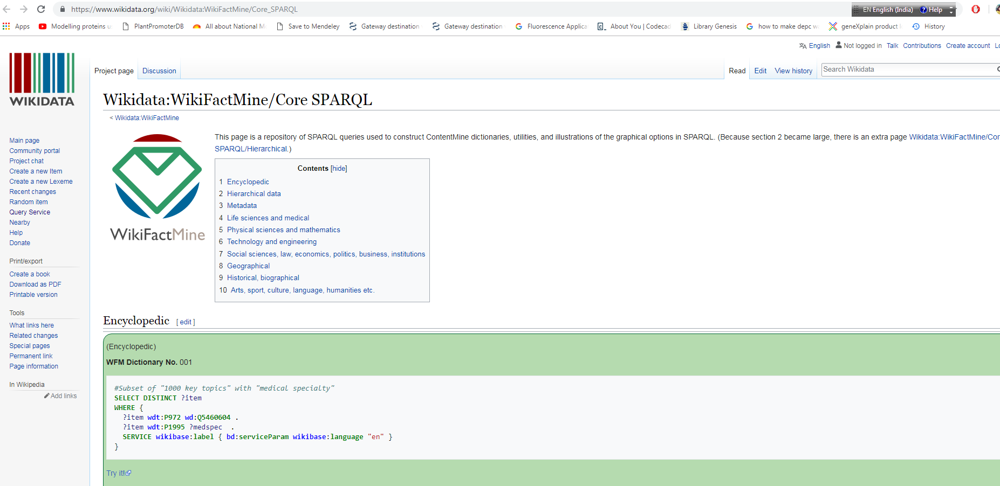

#How to Use `wikiFactMine/Core SPARQL`.

**This page is a repository of `SPARQL queries` used to construct ContentMine dictionaries, utilities, and illustrations of the graphical options in SPARQL.**
*SPARQL( a semantic query language for databases—able to retrieve and manipulate data stored in Resource Description Framework (RDF) format) & allows users to write queries against what can loosely be called "key-value" data or, more specifically, data that follow the RDF specification of the W3C.*

**1.Home Page of wikiFactMine: This page having many WFM(wikiFactMine)Dictionaries with their Numbers.**

**2.Number of Dictionaries  and way for choose them is simply click on `try it` link **

# 

**3. Highlighted Red color box represent that  how we can put query**

**4.This is how  wikiData query service page looks like  shown below**

**5.Here i use an Example of plant taxon "Laurales" in WFM dictionary No 106**

*In red highlighted are we show how query look and with blue button we can run it*

**6. Wheat wikidata Query page having wikidata id (Q) and taxon poales**

**7. Rice Dictionary having `taxon poales` and `wikidata id:Q5090`** 

**8.Try `canidae` and  create Treemap in wikifactMine as shown below**

**9.Ocimum family wikiFactmine Query Service page**

