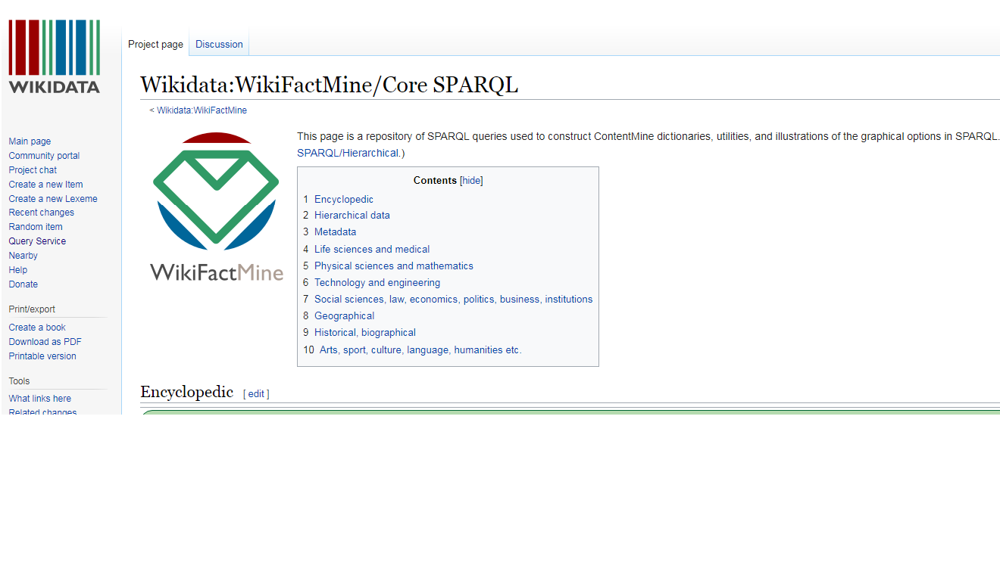
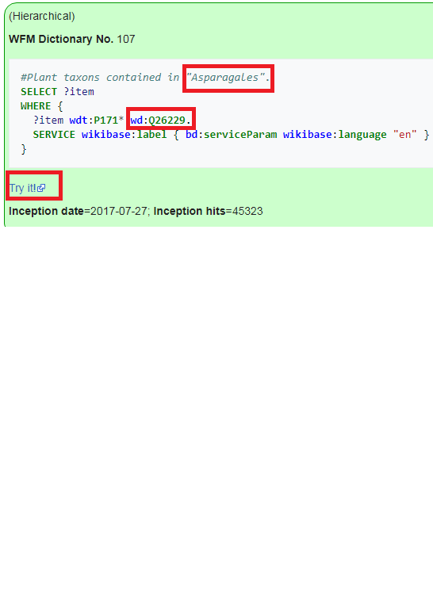
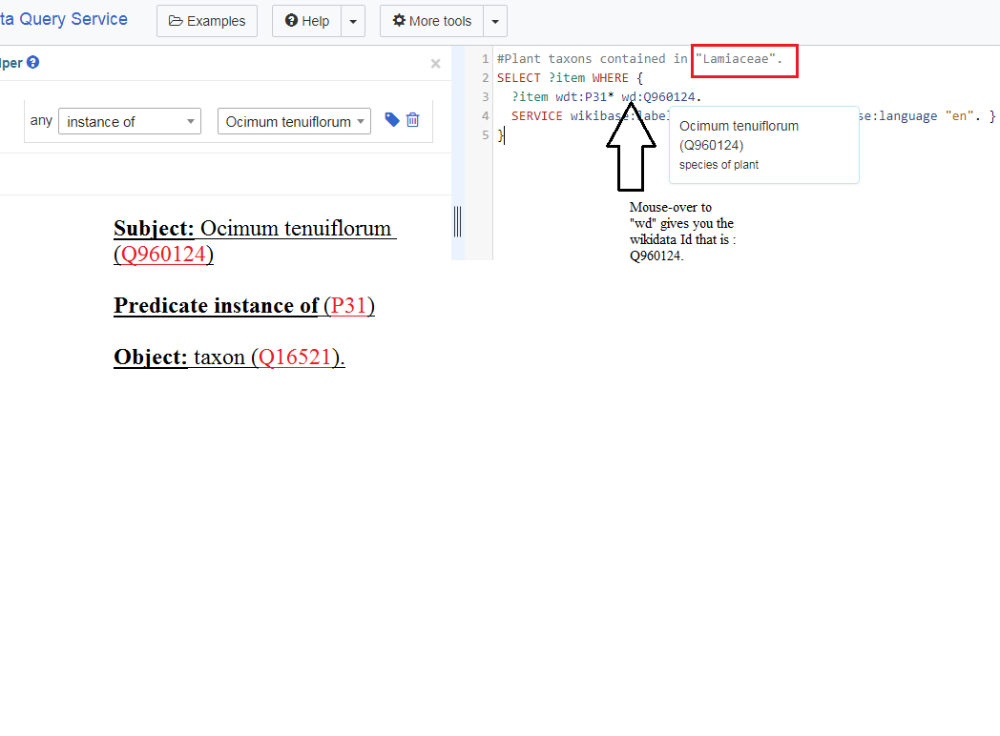
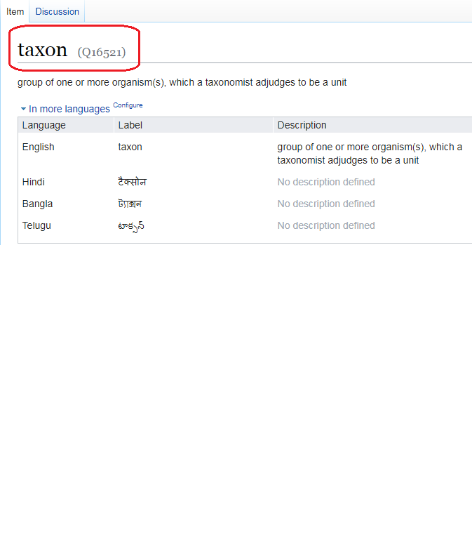
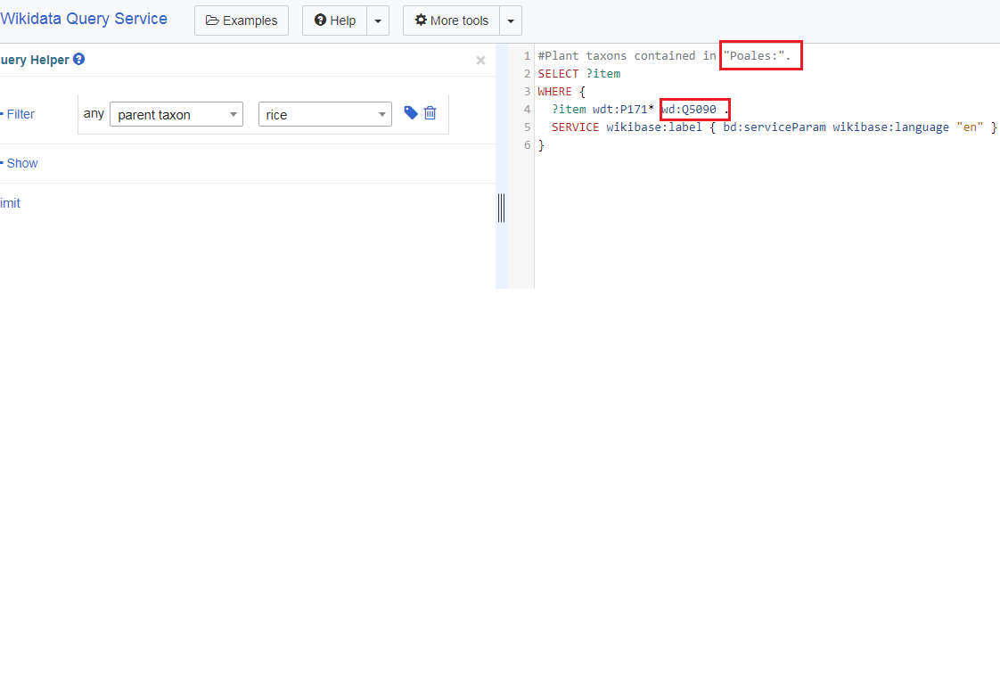
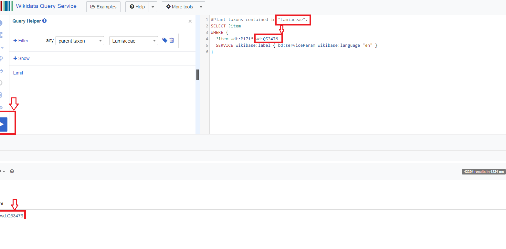

# WikiFactMine
WikiFactMine was a ContentMine project funded by Wikimedia, see [WikiFactMine](https://www.wikidata.org/wiki/Wikidata:WikiFactMine).
It created dictionaries, semantic bibliography and used dictionaries to search HTML/XML articles as in this workshop.

## Dictionaries
The project pioneered the use of Wikidata items as terms in semantic dictionaries. This tutorial will give interactive online resources so you can repeat them. See [https://www.wikidata.org/wiki/Wikidata:WikiFactMine/Core_SPARQL](https://www.wikidata.org/wiki/Wikidata:WikiFactMine/Core_SPARQL);

**This page is a repository of `SPARQL queries` used to construct ContentMine dictionaries, utilities, and illustrations of the graphical options in SPARQL.**
*SPARQL( a semantic query language for databases—able to retrieve and manipulate data stored in Resource Description Framework (RDF) format) & allows users to write queries against what can loosely be called "key-value" data or, more specifically, data that follow the RDF specification of the W3C.*

**1.Home Page of wikiFactMine: This page having many WFM(wikiFactMine)Dictionaries with their Numbers.**

**2.Number of Dictionaries  and way for choose them is simply click on `try it` link.**

**3.This is how  wikiData query service page looks like  shown below.**

**5.Here i use an Example of `plant taxon contained in "Lamiaceae" ` in WFM dictionary.**

   **Copy and Paste this Query into your Wikidata Query Service page.**
   
   
  
`
  #Plant taxons contained in "Lamiaceae".
  SELECT ?item
  WHERE {
  ?item wdt:P31* wd:Q960124.
  SERVICE wikibase:label { bd:serviceParam wikibase:language "en" }
}
`

  *And you get as shown below*
    
    

A.After putting query:

  

B.Click on Results shown below in `item` you get following:

  

C.When you open Wikidata Home page for Ocimum tenuiflorum goto `Statements` and mouseover `instance of` you get `Property:P31` and over `taxon` you Find `Q16521`

   

**6. Wheat wikidata Query page having wikidata id (Q) and taxon poales.**

**7. Rice Dictionary having `taxon poales` and `wikidata id:Q5090`.** 

**9.`Ocimum family` wikiFactmine Query Service page**

