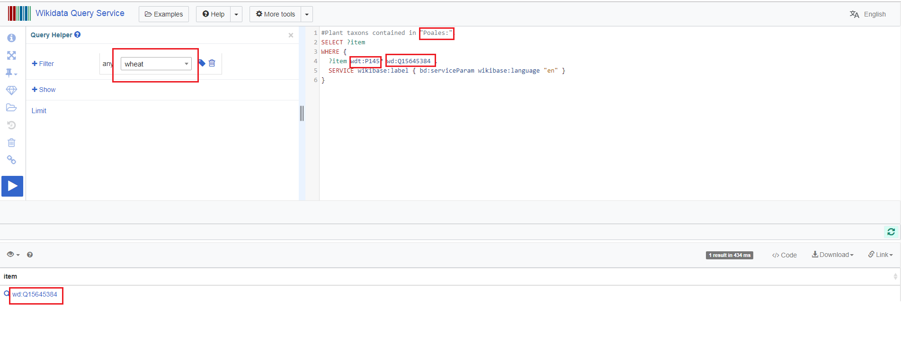
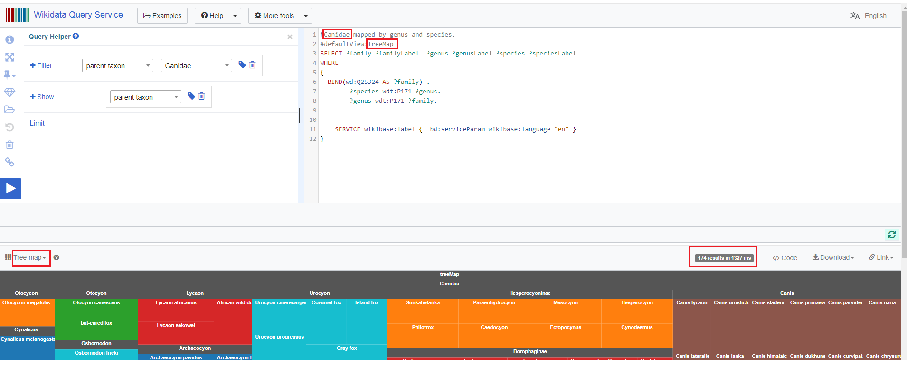
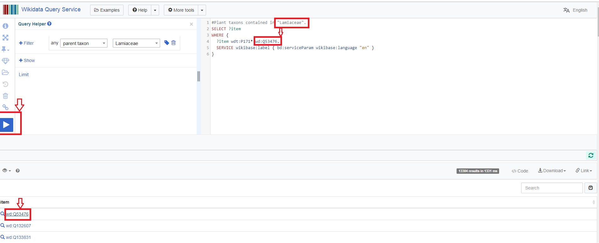

#How to Use `wikiFactMine/Core SPARQL`.

**This page is a repository of `SPARQL queries` used to construct ContentMine dictionaries, utilities, and illustrations of the graphical options in SPARQL.**
*SPARQL( a semantic query language for databases—able to retrieve and manipulate data stored in Resource Description Framework (RDF) format) & allows users to write queries against what can loosely be called "key-value" data or, more specifically, data that follow the RDF specification of the W3C.*

**1.Home Page of wikiFactMine**

*This page having many WFM(wikiFactMine)Dictionaries with their Numbers*

**2.Dictionaries No. and way to choose them**

**3.In screen shot red color box represent that where and how we can put query**

**4.Open wikiData query service page**

**5.Example of plant taxon "Laurales" in WFM dictionary No 106**

*In red highlighted are we show how query look and with blue button we can run it*

**6.Example of Wheat having wikidata and taxon poales**

**7.Using Rice having higher plant taxon poales and wikidata id:Q5090** 

**8.Using canidae we can create Treemap in wikifactMine**

**9.Ocimum family wikiFactmine Query**

